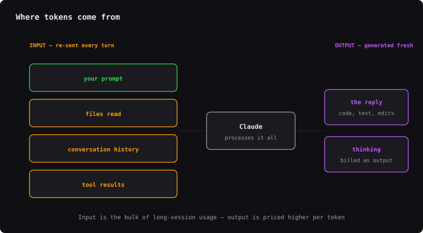
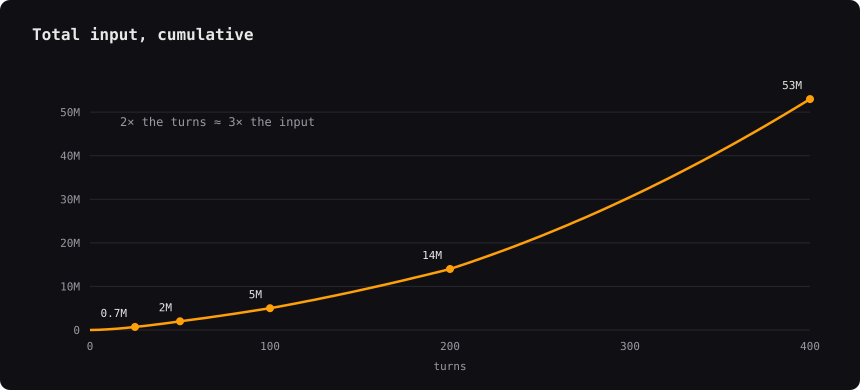
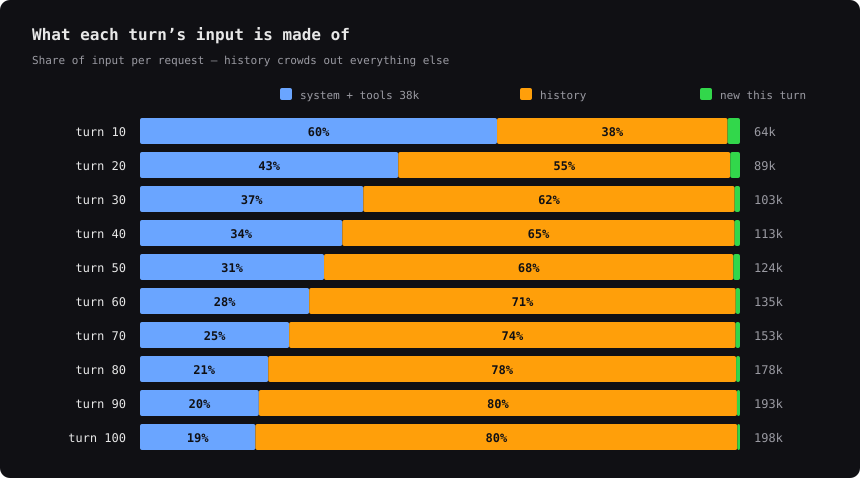
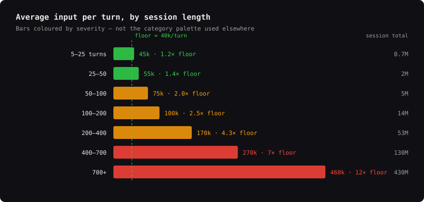

# AI Usage — macOS menu bar

A tiny native menu bar app showing rate-limit and credit usage for the AI
coding tools you actually use: **Claude**, **Codex**, **OpenRouter** and
**Antigravity**.

Claude's 5-hour and weekly windows plus Codex's weekly percentage stay in the
menu bar title by default, and you can put any of the other numbers up there
too — the title is composed from a per-number picker, not a per-provider
one. Reset times, credit balances and live agent sessions are one click away,
alongside a Settings window (⌘,) for visibility, refresh interval and API
keys.


## Providers

| Provider | Source | Needs a key? |
|---|---|---|
| Claude | `GET api.anthropic.com/api/oauth/usage` (Keychain token) | no |
| Codex | `rate_limits` recorded in `~/.codex/sessions/**.jsonl` | no |
| OpenRouter | `GET openrouter.ai/api/v1/credits` | yes |
| Antigravity | `RetrieveUserQuotaSummary` on the `agy` CLI's loopback server | no |

**Codex has no pollable usage API.** It does record the server's `rate_limits`
payload into its session logs on every turn, so this reads the newest entry —
free and local, but only as fresh as your last Codex turn. The row is labelled
with its age (`as of 6d ago`) so a stale number never masquerades as live.

**Antigravity only reports while `agy` is running.** It is a CLI, not a
daemon: it opens a local Connect server for the life of a session and takes it
away again on exit. So this reads the live server when there is one, and
otherwise replays the last reading it saw, dropping each bucket as its own
window resets — a weekly number stays useful for days, a 5-hour one expires by
itself. Replayed rows carry an `as of 3h ago` badge, the same contract the
Codex rows make. With no server and nothing left in the cache, the card says
`agy not running` rather than showing a number it cannot stand behind.

Antigravity reports four numbers, two per quota group: Gemini models (Flash,
Pro) and Claude/GPT models (Opus, Sonnet, GPT-OSS) each have a weekly and a
five-hour limit, and the two groups are entirely independent.

All four providers are visible in the dropdown by default. What reaches the
menu bar title is chosen number by number — see [Settings](#settings).

### Providers that aren't here

The bar for inclusion is a source that reports *real* usage. Two tools that
look like obvious candidates don't clear it:

- **Grok (xAI)** — publishes no usage or credit-balance endpoint at all.
  `/v1/api-key` returns key metadata only, so the best this app could do is
  report whether your key is blocked, which is not usage. Earlier versions
  shipped that row; it was removed rather than continue implying a quota
  reading exists.
- **Gemini CLI** — exposes neither. The CLI itself only learns its quota from
  the metadata attached to a 429.

Antigravity used to be on this list. It was removed from the app in #33
because the RPC available then, `v1internal:retrieveUserQuota`, returned raw
per-model buckets covering only some of the models it serves — the section
could sit at 0% while you were throttled on a model it never reported. It came
back once `RetrieveUserQuotaSummary` shipped, which returns two named groups
spanning the whole product.

One trap worth recording: that RPC also exists remotely, on
`cloudcode-pa.googleapis.com`. Do not reach for it. On a consumer account it
returns `403 SUBSCRIPTION_REQUIRED` on both the production and `daily-` hosts,
with or without a `project`, with or without `client-metadata` headers, and
with the API key baked into the `agy` binary. The endpoint is alive — a bogus
field comes back as a 400 naming that field — it just will not authenticate
you. The local server is the supported path, and it needs no credential at
all. Re-test against a live token before believing otherwise.

## Settings

One **Settings…** (⌘,) click from the dropdown — plain AppKit, no SwiftUI.
Nothing in it needs a restart: prefs are read fresh on every poll and every
menu rebuild.

**Providers** — one *Dropdown* checkbox each, controlling whether that
provider's card appears in the menu.

**Menu bar** — one checkbox per *number*, not per provider: Claude's 5-hour
and weekly, Codex's weekly, and Antigravity's four. Per-provider was the old
design and it cannot express Antigravity, whose two quota groups are unrelated
— a single number standing in for both would hide whichever one you were
actually burning. Claude and Codex are ticked by default, exactly the title
this app has always shown; Antigravity's four start unticked, so upgrading
never widens your menu bar without you asking. An earlier per-provider setting
is carried across on first launch, so a provider you had hidden stays hidden.

A provider hidden from the dropdown *and* contributing no ticked number is not
polled at all — a real saving, since the Anthropic usage endpoint rate-limits
aggressively. One ticked number is enough to keep it polling, because a
headline that stops refreshing would sit in the title looking current.

**Refresh interval** — 1/2/5/10/15 minutes, default 2, floored at 60s for the
same reason: a faster poll trades a working title for a string of 429s.

**Sessions** — show/hide for the whole section. See [Sessions](#sessions).

## API keys

Only OpenRouter needs one. Create it at
[openrouter.ai/keys](https://openrouter.ai/keys) with **no usage limit set** —
the app reads account-wide credits (`GET /api/v1/credits`: granted vs used
across the whole account), not per-key spend, so a key carrying its own credit
limit still authenticates but its limit is invisible here. You would exhaust
the key while the bar still read comfortable.

Highest-precedence source wins:

1. The `OPENROUTER_API_KEY` environment variable.
2. The macOS Keychain — set from **Settings… → API Keys**, service
   `local.claude-usage-menubar`.
3. Legacy `~/.config/claude-usage/config.json`:
   `{ "openrouter_key": "sk-or-v1-…" }`

The legacy file is a permanent fallback, not a deprecation notice: if you
never open Settings it keeps working, un-nagged, and Settings offers a
one-click import rather than requiring one. The key field has **Test**
(validates what's currently typed, so you can try a key before saving) and
**Save** (saving an empty field deletes the Keychain item rather than storing
a blank one). If an env var is set, the field shows disabled rather than being
quietly outranked. A provider without a key shows "no API key" — nothing else
breaks.

Keys go through `/usr/bin/security` rather than Security.framework: this app
is ad-hoc signed, so an item written with `SecItemAdd` came out pinned to that
exact binary and every reinstall brought back a login-password dialog.
[SECURITY.md](SECURITY.md) documents that trade-off and what it does and
doesn't buy.

## Why monitor tokens at all

Every request is stateless: the client re-sends the **entire transcript** —
system prompt, tool definitions, every earlier message, every tool result — as
input, and gets a comparatively tiny output back. So a long session gets
disproportionately expensive in total — roughly 2.7× the input for 2× the
turns — and individually heavier per turn, which is the whole reason the
[Sessions](#sessions) section exists.





What each turn is actually carrying — history crowds out everything else, and
the fixed 38k floor of system prompt and tool definitions is paid every time:



Which is why a turn gets steadily more expensive the longer a session runs —
from the 38k floor to roughly 2.5× it by 100 turns:



[docs/token-metering.md](docs/token-metering.md) has the rest: the anatomy of
one turn, the context window filling, per-turn cost by session length, when
caching helps, and why output is a rounding error. Every chart is generated
from measured sessions by [`tools/token_charts.py`](tools/token_charts.py).

## Sessions

A read-only view of your **live** Claude Code and Codex processes, answering
one question: *should I clear this session?* It only reads process state and
on-disk logs — no cost estimate, no history, no way to kill or attach to a
session from here.

A **turn** here is one request to the model and its reply — not one thing you
type. If the model calls three tools before answering, that is four turns, and
each one re-sends the whole conversation so far. Two complementary signals
drive each row:

- **contextPercent** — how full the context window is, against the model's
  window size. Absolute, but only as good as the window it's dividing by.
- **BLOAT** — how much a turn costs *now* versus the same session's first few
  turns; `5.2x` means each turn is dragging five times the context it started
  with. It resets when the session compacts, and it needs no context-window
  constant at all, so it stays correct even where contextPercent is working
  from a wrong denominator. (`xFloor` in the source.)

Row colour is the **worse of the two** — a session that opened with one huge
turn pins BLOAT near 1.0x forever while contextPercent quietly climbs toward
full, and neither signal alone would catch that.

Compaction is surfaced per session: how many, how long since the last, and
what it reclaimed (context before → after). A session with zero compactions
shows nothing for it, and one with no usage recorded since a compaction fired
shows reclaim as pending (`—`), never a fabricated 0% or 100%.

Clicking a row expands its `cwd` and compaction detail in place, without the
menu closing.

The `●`/`○` glyph tracks whether the process is currently busy. A brand-new
session shows "starting — no usage yet" instead of a bar, and one whose
context window couldn't be resolved shows raw tokens with "window unknown"
rather than a fabricated denominator.

## Install

```bash
git clone https://github.com/burnett-madoc-corp/claude-usage-menubar.git
cd claude-usage-menubar
./install.sh
```

Needs macOS 13+ and Xcode command line tools — see
[Requirements](#requirements) below. Copies the app to `/Applications` and
registers a LaunchAgent so it starts at login. To build and run without
installing:

```bash
./build.sh && open build/ClaudeUsage.app
```

The app's own API key never raises a Keychain dialog (see above). Claude
Code's OAuth token carries its own access rules, so macOS may ask about that
one once — choose **Always Allow**.

### If the menu bar item never appears

On macOS 26 a third-party status item is not a window the app draws. It is a
scene hosted by ControlCenter, allowed or denied per app against a list
ControlCenter persists — and a denial is silent. The app runs, believes its
item is visible, reports a sensible width, and nothing is ever drawn.

Two things put an app on that list:

- **Being launched as a raw executable.** A launchd job whose
  `ProgramArguments` is the binary inside the bundle gets an `osservice`
  identity, and the default verdict for one with no existing record is *deny*.
  Launching through `open(1)` gives a real application identity, whose default
  is *allow*. `install.sh` writes the LaunchAgent the second way; do not
  "simplify" it back to the executable path.
- **Replacing the bundle.** `install.sh` uses `ditto` into the existing
  `.app` rather than `rm -rf` + `cp -R`, so the bundle is never destroyed and
  recreated under a new identity mid-update.

If an app is already on the blocked list, no reinstall clears it — the record
is keyed by bundle id and survives ControlCenter restarts. The only supported
writer is the Settings pane:

**System Settings → Menu Bar → Allow in the Menu Bar** → toggle **ClaudeUsage
off, then on**, then:

```bash
launchctl kickstart -k gui/$UID/local.claude-usage-menubar
```

The toggle already reading "on" does not mean the app is allowed; the pane and
the enforcement record can disagree.

### Uninstall

```bash
launchctl bootout gui/$UID/local.claude-usage-menubar
rm -rf /Applications/ClaudeUsage.app ~/Library/LaunchAgents/local.claude-usage-menubar.plist
```

## Headless mode

```bash
/Applications/ClaudeUsage.app/Contents/MacOS/ClaudeUsage --once
```

Prints the same numbers — every provider card plus any live Sessions — and
exits; useful for scripting or a shell prompt. Unlike the live dropdown,
`--once` ignores whatever is hidden in Settings.

It also prints the menu bar title: which metrics are ticked, the value each
one currently holds, and the exact string the title composes to. The title is
the app's most important surface and used to be the one thing no diagnostic
could show, which made "the item looks blank" impossible to investigate
without a screenshot.

```bash
/Applications/ClaudeUsage.app/Contents/MacOS/ClaudeUsage --status-check
```

Asks the status item what it thinks of itself — whether macOS considers it
visible, its width, and where on which screen it was placed — then exits:

```
isVisible      = true
length         = -1.0
button frame   = (0.0, 0.0, 202.0, 22.0)
window frame   = (1854.0, 1307.0, 202.0, 22.0)
screen         = (0.0, 0.0, 2056.0, 1329.0)
title          = " 5h 0% wk 63%    wk 100%" (26 chars)
```

A missing menu bar item is otherwise undebuggable from the outside: a
zero-width button, an item macOS has hidden, and an item placed off the edge
of a screen all look identical — nothing at all.

## How it works

Every provider is polled concurrently on the configured refresh interval, but
rendered in a fixed order so rows never jump around. A failed poll keeps the
last good numbers and marks them `stale` rather than blanking the section — the
Anthropic usage endpoint rate-limits aggressively, and a transient 429 should
not look like an outage.

**Claude** — `GET /api/oauth/usage`, the same endpoint Claude Code's own
`/usage` uses. The `limits` array is authoritative: `kind: "session"` is the
5-hour window, `weekly_all` the weekly one, and `weekly_scoped` entries carry a
`scope.model.display_name` like `Fable`. Scoped windows are iterated, not
hardcoded, so new per-model caps appear on their own.

**Sessions** — no network call at all. Live processes come from `ps`; Claude
session data from an incremental, byte-offset read of
`~/.claude/projects/**/*.jsonl` (only newly-appended bytes are ever re-read);
Codex from a strictly read-only query against `~/.codex/state_*.sqlite` plus
the same incremental read of its rollout log. The section re-scans every 2
seconds *while the dropdown is open*, and that tick stops the moment you close
the menu.

## Deliberate limitations

The app **only ever reads** credentials; it never writes and never redeems a
refresh token. Anthropic rotates refresh tokens on use, so redeeming one here
would invalidate the token Claude Code itself holds and break its login. The
trade-off: if a token expires while you aren't using that tool, the app says
*"Token expired — run `claude` to refresh"*. Running it once repairs the
token, and since credentials are re-read on every poll the app recovers on its
own — no restart.

Sessions carries its own, smaller set:

- **Claude's context window is the configured/inferred one, not necessarily
  the live one.** It's resolved in tiers (session settings, then a subagent's
  `resolvedModel`, then an observed-usage upgrade to 1M past 200k), but no
  transcript event records a mid-session `/model` switch, so contextPercent
  can lag. **BLOAT is unaffected** — it never touches a window size.
- **Codex session matching is start-time proximity, not identity.** A live
  `codex` process is matched to its `state_*.sqlite` thread row by cwd plus
  being within 5 seconds of that thread's `created_at_ms`. A resumed session
  falls outside that window and renders "(unmatched)" rather than being
  silently guessed at.
- **Both data sources are undocumented and may change.** Reads degrade rather
  than crash: a missing file, table, column, or a locked database all resolve
  to "no sessions from this source", never a fatal error.

## Requirements

macOS 13+ and Xcode command line tools (for `swiftc`) to build. `build.sh`
compiles an arm64 slice and an x86_64 slice separately and combines them with
`lipo` into one universal binary, so the built app runs natively on both
Apple Silicon and Intel Macs — there is no per-architecture build to choose.
Also needs a logged-in Claude Code install. No third-party dependencies.

## Contributing

Issues and pull requests are welcome — see [CONTRIBUTING.md](CONTRIBUTING.md)
for the build/test loop and PR conventions, and
[CODE_OF_CONDUCT.md](CODE_OF_CONDUCT.md) for how discussion is expected to go.

```bash
./build.sh && build/ClaudeUsage.app/Contents/MacOS/ClaudeUsage --self-test
```

CI runs exactly that on a hosted macOS runner, plus
`.github/scripts/static_checks.py` and `tools/check_charts.py` (geometry and
cross-chart number checks over the committed SVGs). CodeQL analyses the Swift
sources on every push to `main`, on every pull request, and weekly.

## Security

The app only ever **reads** credentials that other tools own, and never redeems
a refresh token. The OpenRouter key you enter is stored in your login Keychain.
There is no telemetry and no network egress beyond the provider endpoints
listed above. [SECURITY.md](SECURITY.md) documents that boundary in full and
explains how to report a vulnerability privately.

## Licence

[MIT](LICENSE) © 2026 Alexander Burnett.
