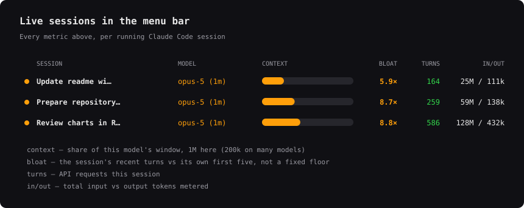

# How tokens are metered

Every request to the model is stateless: the client re-sends the **entire
transcript** — system prompt, tool definitions, every earlier message, every
tool result — as *input*, and gets a comparatively tiny *output* back. That one
fact explains every curve below, and it is why watching your usage windows
mid-session pays off.

## Anatomy of one turn

## Input grows faster than session length

Per-turn input rises roughly linearly, so the cumulative total rises faster
than the turn count — about **2.7× the input for 2× the turns** over the range
plotted. It tends toward a true square only once history dwarfs the fixed
floor; measured across 25→100 turns the exponent is 1.44, not 2.0. Quoting
"quadratic" overstates it at the session lengths anyone actually runs.

## The context window fills — it never grows

Old tool output, big diffs, and file dumps you no longer need are **bloat**:
they ride along on every subsequent turn, cost tokens each time, and crowd out
the window. Past ~80% the tooling starts compacting for you — on its schedule,
not yours.

## Per-turn cost by session length

The floor is ~38k input tokens/turn (system prompt + tools + a short history),
measured as the median first-request context across the sessions below. A useful
health metric for any session is how much heavier its average turn is than that
cheapest possible turn.

Note the bands come from *all* 45 sessions, at every length, while the other
charts follow a single cohort — the 25 sessions that ran past 100 turns. That is
why this chart alone carries an `n` per row: the 5–25 and 700+ bands rest on one
session each and should not be read as firmly as the middle ones.

The app's `BLOAT` column answers the same question with a different baseline:
it compares the current turn against *that session's own* first few turns
(or since its last compaction) rather than against an absolute 38k. That makes
it robust to a session whose floor is genuinely higher — a big system prompt,
many MCP tools — at the cost of being uncomparable between sessions. The bands
above are the cross-session view; `BLOAT` is the within-session one.

## Prompt caching softens the blow — conditionally

## Output is a rounding error

## What this looks like in the app

An illustration of the Sessions panel, not a screen capture — the rows are three
real measured sessions, and the two footnotes match what the app actually
computes: `CONTEXT` is a share of *that session's* model window, and `BLOAT` is
its recent turns against its own first five, not against the ~38k floor above.

## Why monitor this

- **Windows burn on input, not effort.** A 200–400-turn session meters ~72M
  input tokens — the same work split into shorter sessions costs a fraction of
  it.
- **Know when to `/clear`.** Starting fresh resets per-turn cost to the floor;
  the band chart shows what staying in a bloated session costs instead.
- **Compact on your terms.** Watching context fill lets you compact at a natural
  checkpoint instead of mid-task at 80%.
- **Protect the cache.** A stable prefix makes ~98% of input cheap cache reads
  by turn 10; knowing that changes how you structure a session.

## Where these numbers come from

Every chart here is generated by [`tools/token_charts.py`](../tools/token_charts.py)
from one measurement pass over the local Claude Code transcripts — 45 sessions,
8,942 deduped requests, snapshot 2026-08-12. No chart carries its own copy of a
number, which is what keeps any two of them from disagreeing;
`tools/check_charts.py` then checks the rendered geometry for overflow, labels
struck through by their own curve, and quantities restated inconsistently
between charts.

Two limits worth stating. Context per request is
`input_tokens + cache_read + cache_creation`, and `usage` records repeat in the
transcript, so they are deduped on `requestId` — undeduped they inflate ~1.8×.
And extended thinking is billed as output but never written to the transcript,
so the output figures are a floor, not a total.

*Exact values vary by model, tools enabled, and workload; the window in
particular is model-dependent — 200k on many models, 1M on others.*
