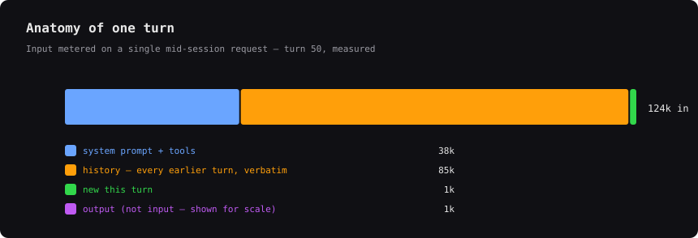
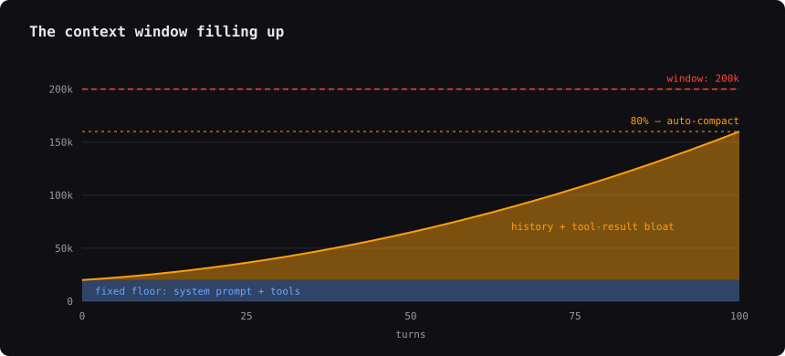
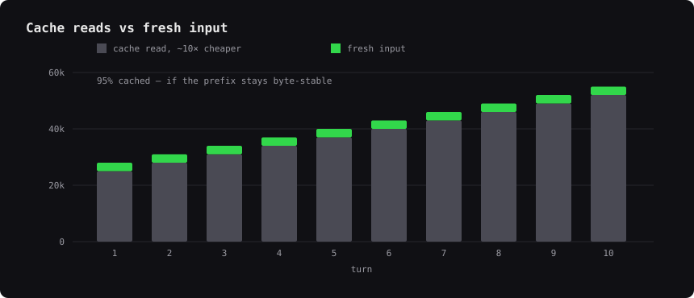
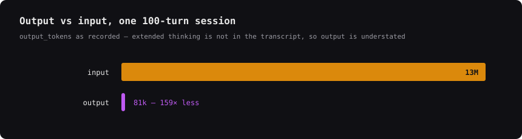

# How tokens are metered

Every request to the model is stateless: the client re-sends the **entire
transcript** — system prompt, tool definitions, every earlier message, every
tool result — as *input*, and gets a comparatively tiny *output* back. That one
fact explains every curve below, and it is why watching your usage windows
mid-session pays off.

## Anatomy of one turn

## Input grows with the square of session length

## The context window fills — it never grows

Old tool output, big diffs, and file dumps you no longer need are **bloat**:
they ride along on every subsequent turn, cost tokens each time, and crowd out
the window. Past ~80% the tooling starts compacting for you — on its schedule,
not yours.

## Per-turn cost by session length

The floor is ~40k input tokens/turn (system prompt + tools + a short history).
A useful health metric for any session is how much heavier its average turn is
than that cheapest possible turn.

The app's `BLOAT` column answers the same question with a different baseline:
it compares the current turn against *that session's own* first few turns
(or since its last compaction) rather than against an absolute 40k. That makes
it robust to a session whose floor is genuinely higher — a big system prompt,
many MCP tools — at the cost of being uncomparable between sessions. The bands
above are the cross-session view; `BLOAT` is the within-session one.

## Prompt caching softens the blow — conditionally

## Output is a rounding error

## Why monitor this

- **Windows burn on input, not effort.** One 400-turn session meters ~53M input
  tokens — the same work split into four short sessions costs a fraction of it.
- **Know when to `/clear`.** Starting fresh resets per-turn cost to the floor;
  the band chart shows what staying in a bloated session costs instead.
- **Compact on your terms.** Watching context fill lets you compact at a natural
  checkpoint instead of mid-task at 80%.
- **Protect the cache.** A stable prefix makes ~95% of input cheap cache reads;
  knowing that changes how you structure a session.

*Numbers are rounded from measured Claude Code sessions; exact values vary by
model, tools enabled, and workload.*
